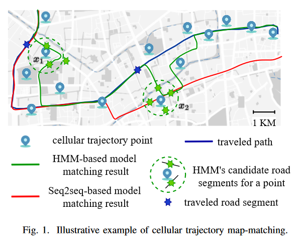
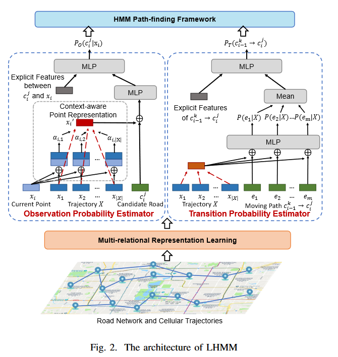

Here is Weijie Shi (Jason, 史伟杰).

I am a second year postgraduate in **Computer Science and Technology** at Soochow University (Suzhou, China). I am extremely fortunate to be advised by [Jiajie Xu](http://web.suda.edu.cn/xujj/).

Research Interests
======
My previous research focuses on practical problems that artificial intelligence faces in real life. My interests are on the **Machine Learning** and its applications in **Traffic System** (such as map-matching, trajectory similarity computation). In a word, advanced technologies like ML and Traffic System positively influence the life of everybody (e.g. security tracking, traffic management, etc.).

Recently, with the booming development of **large language models (LLMs)**, we have been amazed to witness the barriers between machines and natural languages being broken down. Many fascinating projects have utilized LLMs as controllers to create powerful automated and integrated tools (such as HuggingGPT, Visual ChatGPT, AutoGPT, ToolFormer). The combination of various tools with LLMs has led to a further burst of vitality. However, the fatal flaw of LLMs is their inability to guarantee trustworthy responses. **Extracting knowledge from the internet, storing knowledge in a structured manner, and indexing knowledge to assist large models** will greatly enhance the LLMs' ability to understand and express knowledge. I wish to devote my talent to this meaningful cause and bring well-being to society.

Personal Skills: I understand and apply mainstream deep learning methods (Transformer, Diffusion, RL, GAN, VAE, CNN, RNN, GCN), and integrated learning frameworks (XGboost, Catboost, LightGBM). I am proficient in using Python and Pytorch, able to use Spark and Scale. What'more, I also skilled of feature engineering techniques, has participated in the Tianchi competition and achieved a ranking of 6/670.

Publications
======
- [ICDE 2023](https://icde2023.ics.uci.edu/) The 39th IEEE International Conference on Data Engineering
  LHMM: A Learning Enhanced HMM Model for Cellular Trajectory Map Matching
  **Weijie Shi**, Jiajie Xu, Junhua Fang, Pingfu Chao, An Liu, and Xiaofang Zhou
  [PDF](https://shiweijiezero.github.io/weijie.github.io/files/LHMM.pdf)
  [Source Code](https://github.com/shiweijiezero/LHMM)

  The brief description of this paper is as follows:
  As shown in figure 1, **map-matching** is a problem to align recorded location data to a digital map. It has been well studied to map GPS data collected from vehicles to paths in a road network. The problem of **Cellular Trajectory Map-Matching (CTMM)** is a new problem that deals with trajectories of cellular-based positioning data. It has a wide range of applications, for example, for telecommunication companies to understand and predict traffic information based on telecom tokens obtained from vehicles. CTMM is a significantly more challenging task that faces much **lower data precision and higher positioning errors**.
  
  

While **Hidden Markov Model (HMM)** based methods can achieve satisfactory results for GPS-based map matching, we show that they cannot be directly applied to the CTMM problem. In this paper, we aim at **reducing the impact of positioning errors by incorporating knowledge obtained by neural networks into learned probabilities**. 

As depicted in figure 2, a multi-relational graph learning method is developed to generate meaningful embedding, with multi-relational useful information fully preserved in a shared space. An attentive neural network is then designed as the learner for observation probability, incorporating the knowledge of the dynamic correlation between roads and cell towers under varying trajectory contexts. A transition probability learner is used to capture implicit deep features for enhanced transition probability modeling. Finally, the learned observation and transition probabilities are seamlessly integrated into HMM to guide more accurate path-finding. Extensive experiments on two large-scale cellular datasets reveal that our approach achieves high accuracy and robustness on CTMM.

